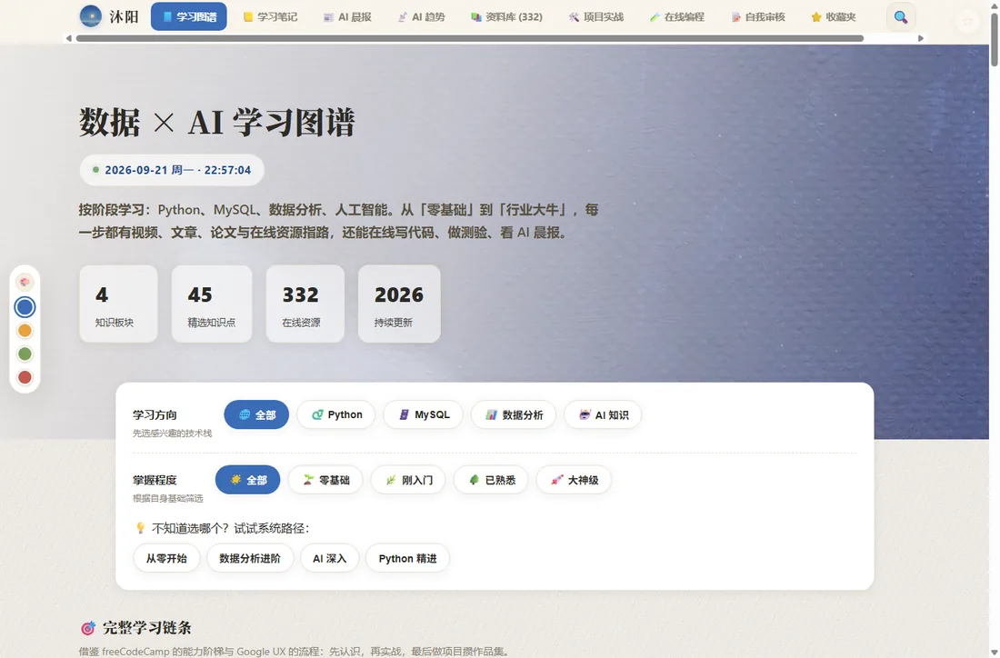
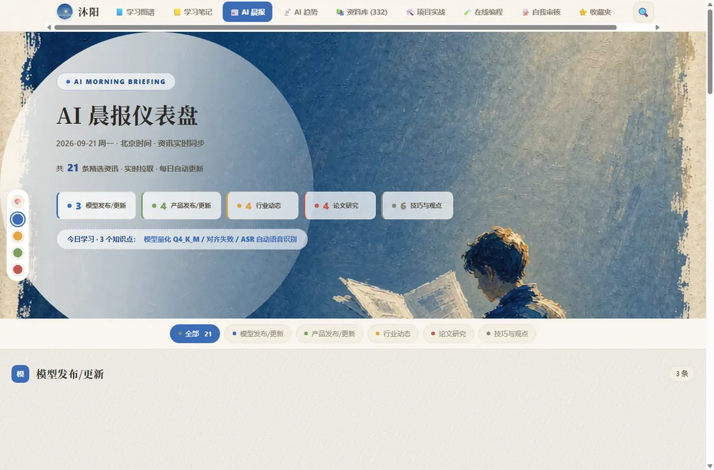

# 🌅 沐阳 · 数据与 AI 学习图谱

> 一个由 AI 协作开发、人主导设计与质量验收的纯静态个人知识平台 —— 从内容生产、数据管道到质量工程的完整闭环。

**线上访问**：[https://tzmlyy-lgtm.github.io/muyang-aiknowledge](https://tzmlyy-lgtm.github.io/muyang-aiknowledge) · 支持添加到主屏幕（PWA）、离线可读



## ✨ 它是什么

「沐阳」是一个面向数据与 AI 学习者的个人知识管理平台。它把分散的学习资料整合为一张体系化的图谱：

| 板块 | 内容 |
|---|---|
| 📘 学习图谱 | 45 个知识点（Python / MySQL / 数据分析 / AI），四级掌握度分级，每个知识点挂真实在线资源 |
| 📒 学习笔记 | 21 篇精选笔记，内置 Markdown 阅读器 |
| 📰 AI 晨报 | 五大版块资讯仪表盘，每日自动更新 |
| 📡 AI 趋势 | 六大核心切片、关键数据、三极格局、2026 预测 + 实时资讯流 |
| 📚 资料库 | 332 条在线资源（12 分类）+ 272 条晨报知识库存档 + 185 份本地 PDF 索引 |
| 🛠️ 项目实战 | 10 个可复现 GitHub 项目 + 6 个站内项目 |
| 🧪 在线编程 / 📝 自我审核 | 浏览器内写代码；4 科 × 15 题测验与解析 |
| ⭐ 收藏夹 | 全站六类内容的统一收藏汇总 |



## 🚀 特性

- **资讯全自动运转** —— 对接实时资讯 API，30 分钟共享缓存 + 三级容灾（实时拉取 → 每日快照 → 内置兜底），零人工维护
- **全站搜索（Ctrl+K）** —— 一个输入框聚合知识点 / 笔记 / 资料 / 晨报存档 / 项目，空格分词多条件匹配，全键盘操作
- **PWA** —— manifest + Service Worker，手机「添加到主屏幕」即 App，断网打开秒出页面
- **厚涂水粉视觉体系** —— 每个视图配专属水粉插画，纸张颗粒质感，日 / 夜间双主题，4 色点缀色板可定制
- **独立 URL** —— hash 路由，每个视图可直达、可分享（如 `#briefing`）
- **性能** —— 图像资产全量 WebP（17MB → 1.1MB）、收藏数据内存缓存、字体异步加载，弱网与多端流畅
- **SEO** —— Open Graph / Twitter Card / JSON-LD 结构化数据 / sitemap / robots

## 🤖 AI 协作开发工作流

本项目全程采用 **「需求拆解 → AI 执行 → 人工验收 → 自动化回归」** 的人机协作模式：

- **人的角色**：产品定义、信息架构、技术选型、关键决策与全部产出的质量把关
- **AI 的角色**：代码实现、水粉视觉生成、文档撰写与故障排查
- **质量验收体系（四层）**：

```
语法检查(node --check)
  └─ 自动化回归测试(node + DOM stub，模拟 9 视图切换)
      └─ HTML 结构校验 + JS 引用 id 交叉比对
          └─ 无头浏览器(Edge --headless)线上冒烟验证
```

> 项目曾发生过一次「语法全部正确、整站 JS 却不执行」的故障（畸形 `<script>` 闭合标签触发 HTML5 解析规范问题）。
> 正是这套四层体系让根因在真实浏览器冒烟中被捕获 —— AI 的产出边界，靠体系化的验收去确认，而不是靠信任。

## 📦 本地运行

```bash
git clone https://github.com/tzmlyy-lgtm/muyang-aiknowledge.git
cd muyang-aiknowledge
python -m http.server 8000    # 或直接双击 index.html
# 打开 http://localhost:8000
```

无构建、无依赖、无框架 —— 一个 `index.html` + 10 个数据/逻辑脚本即为全部。

## 🗂️ 项目结构

```
├── index.html              # 单页应用主体（视图结构 + 样式）
├── script.js               # 全部交互逻辑（渲染/搜索/收藏/路由/主题/PWA 注册）
├── knowledge.js            # 学习图谱数据（板块/知识点/资源）
├── docs-data.js            # 在线资源库
├── brief-library-data.js   # AI 晨报知识库存档（272 条）
├── notes-data.js           # 学习笔记
├── pdfs-data.js            # 本地 PDF 索引
├── quizzes.js              # 测验题库（4 科 × 15 题）
├── briefing-data.js        # 晨报内置兜底数据
├── ai-trends-data.js       # AI 趋势静态数据
├── manifest.webmanifest    # PWA 清单
├── sw.js                   # Service Worker（预缓存 + stale-while-revalidate）
├── verify_init.mjs         # 回归测试（DOM stub 模拟全视图）
└── images/                 # 水粉插画 / 图标（WebP）
```

## 🔄 数据更新机制

```
AI HOT 实时接口 ──30min 共享缓存──▶ AI 晨报视图 / AI 趋势视图
        │
        └─ 失败时 ──▶ news-data.json 每日快照 ──▶ 内置离线数据（三级兜底）
```

## 🗺️ 路线图

- [x] 全站搜索（Ctrl+K）
- [x] PWA 离线可读
- [ ] 作品集页面（学习 → 实战 → 作品叙事）
- [ ] 学习进度打卡与掌握度热力图
- [ ] AI 周报（聚合 7 天晨报）
- [ ] 站内 AI 学习助手（RAG）

## 📄 License

内容与设计 © 2026 沐阳 · 仅供学习交流使用。
